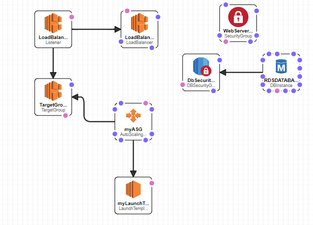

# IIC2173 - Entrega 2 - Grupo 23

## Dominio 

[https://myfirstchatapp.me/](https://www.myfirstchatapp.me/)

## Sección mínima

1.- (10pts) Implemente el proyecto de "infraestructura como código" para montar su sistema actual en un nuevo ambiente. 2.- (5pts) Documente el código realizado
para implementar la estructura de su "IaaC" y comente dónde existe espacio de mejora. (Hint: probablemente exista un espacio en donde se podría reutilizar código
si quisiera crear un ambiente de staging y uno productivo)

### Logrado

### Documentación IaaC

El objetivo de aplicar IaaC en esta entrega, fue replicar nuestra infraestructura en Backend de la entrega anterior. De esta manera, se puede tener un ambiente de staging en el cual se puede utilizar para verificar que la aplicación esté funcionando correctamente.

Primero creamos un nuevo Auto Scaling Group llamado ‘myASG’. Este lo asociamos con un Launch Template ‘myLaunchTemplate’ que nos permite obtener la imagen a partir de la cual se crean las nuevas instancias. La AMI asociada fue creada a partir de la instancia original con la que se trabajó en entregas pasadas. Además, ‘myASG’ fue asociado con un Target Group para trabajar con un Load Balancer. El Load Balancer Listener está monitoreando constantemente la carga del Load Balancer, de forma que a través de los Targets Groups es capaz de redirigir las solicitudes de clientes a instancias menos cargadas. También, se replicaron las características de seguridad de las configuraciones originales.

Creamos una nueva base de datos usando RDS en postgres, llamada ‘RDSDATABASE’, la cual se configuró con su respectivo grupo de seguridad, el que permite el tráfico de entrada y salida para las instancias del Auto Scaling Group.

Creamos un dominio nuevo para el Auto Scaling Group para poder probar el correcto funcionamiento de la API: [https://servermyfirstchatapp.tk/](https://servermyfirstchatapp.tk/)
